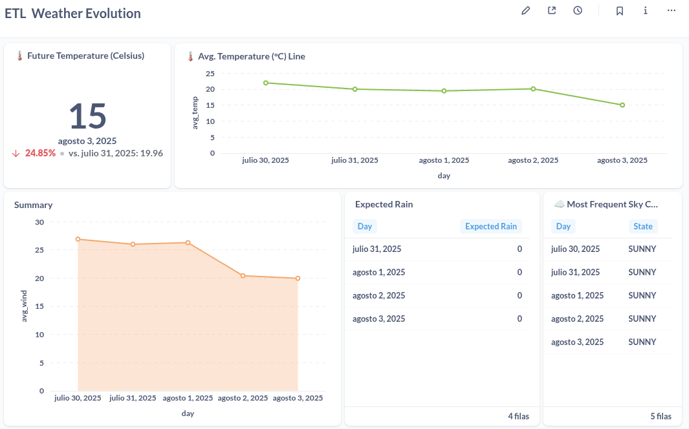

# 🌦️ ETL Weather Pipeline – MeteoGalicia Data

Automated ETL pipeline that scrapes weather forecast data from the **MeteoGalicia public API**, stores it daily in **Parquet** format, loads it into a **PostgreSQL** database, and makes it available for **visual exploration with Metabase**.

This project runs **fully automated**, even if the machine was turned off during the scheduled scraping time — thanks to robust integration with `anacron`.

---

## 🚀 Features

- ✅ Scheduled scraping from MeteoGalicia API
- ✅ Environment isolation using `.env` (API key, DB credentials)
- ✅ Storage of forecast data in `.parquet` format by day
- ✅ PostgreSQL ingestion with deduplication (`datetime + variable`)
- ✅ Daily automation with `anacron`, tolerant to shutdowns
- ✅ Metabase-ready schema with example queries and dashboards

---

## 📊 Example Use Cases

- Personal/local weather dashboards (e.g., for urban planning, agriculture, or home automation)
- Edge computing setups like Raspberry Pi
- Historical forecast model tracking
- Public data integration pipelines

---

## 🧱 Project Structure

```text
etl-weather-pipeline/
├── scripts/
│   ├── scrape_meteogalicia_api.py     # API ingestion + Parquet + DB load
│   └── load_parquet_to_pg.py          # Standalone loader
├── data/
│   └── parquet/                       # Daily forecast files (.parquet)
├── .env.example                       # Environment variable template
├── requirements.txt                   # Python dependencies
├── README.md                          # You are here
```

---

## 🧪 How It Works

1. 📡 Scrapes weather forecast JSON from MeteoGalicia API
2. 🧹 Parses and normalizes it into a `pandas.DataFrame`
3. 💾 Saves it as a dated `.parquet` file
4. 🛢️ Inserts into PostgreSQL, avoiding duplicates with `ON CONFLICT DO NOTHING`
5. 📈 Data can be explored via Metabase or any BI tool

---

## 🔧 Setup

### 1. Clone the repository

```bash
git clone https://github.com/YOUR_USERNAME/etl-weather-pipeline.git
cd etl-weather-pipeline
```

### 2. Create a `.env` file

```bash
cp .env.example .env
```

Fill in your API key and PostgreSQL credentials:

```dotenv
METEOGALICIA_API_KEY=your_api_key_here
PG_USER=your_pg_user
PG_PASS=your_pg_password
PG_DB=meteo
PG_HOST=localhost
PG_PORT=5432
```

### 3. Install Python dependencies

```bash
pip install -r requirements.txt
```

### 4. Run the pipeline manually (for testing)

```bash
python3 scripts/scrape_meteogalicia_api.py
```

---

## 🔁 Daily Automation with `anacron`

This project uses `anacron` to guarantee daily execution, even when the system is shut down during the scheduled time.

Add this script to `/etc/cron.daily/meteo_scraper`:

```bash
#!/bin/bash
sleep 900  # Wait 15 minutes after boot
/usr/bin/python3 /path/to/scripts/scrape_meteogalicia_api.py >> /home/YOUR_USER/meteo_anacron.log 2>&1
```

Make it executable:

```bash
sudo chmod +x /etc/cron.daily/meteo_scraper
```

Done ✅

---

## 🧮 Database Schema

### PostgreSQL table: `weather_forecast`

```sql
CREATE TABLE weather_forecast (
    datetime TIMESTAMPTZ,
    variable TEXT,
    value TEXT,
    model TEXT,
    grid TEXT,
    unit TEXT,
    lon DOUBLE PRECISION,
    lat DOUBLE PRECISION,
    PRIMARY KEY (datetime, variable)
);
```

---

## 📊 Metabase Integration

Once PostgreSQL is populated, simply connect it to **Metabase** and build beautiful dashboards.

Suggested visualizations:

- Temperature trend over time (Area chart)
- Daily rainfall accumulation (Bar chart)
- Most frequent sky condition per day
- Wind speed variation (Line chart)
- Interactive filters by date, variable, model

<details>
<summary>📸 Example Dashboard</summary>




</details>

---

## 🧠 Things You’ll Learn

- Working with REST APIs in Python (`requests`)
- Data transformation using `pandas`
- File formats: Parquet with `pyarrow`
- PostgreSQL ingestion via `SQLAlchemy`
- Automation via `anacron` and `cron.daily`
- Visual analytics with Metabase
- Robust pipeline structure and logging

---

## 📌 License

MIT License

---

## 🙋‍♂️ Author

**Jorge Miguel Espinosa**  
[GitHub](https://github.com/JorAlEs) | [LinkedIn](https://www.linkedin.com/in/jorge-alc%C3%A1ntara-espinosa-570055356/)

---

> If you find this project useful, feel free to ⭐ star the repo or share it!
